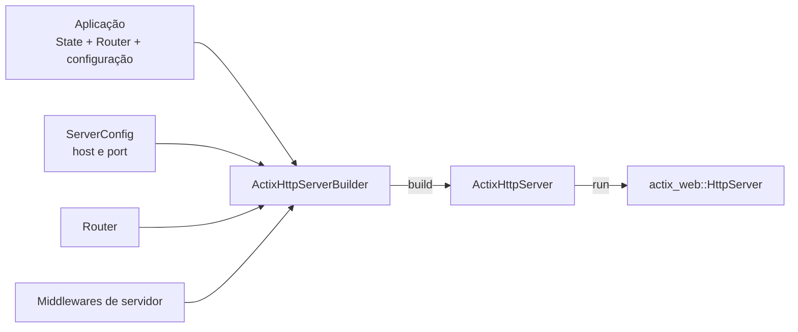
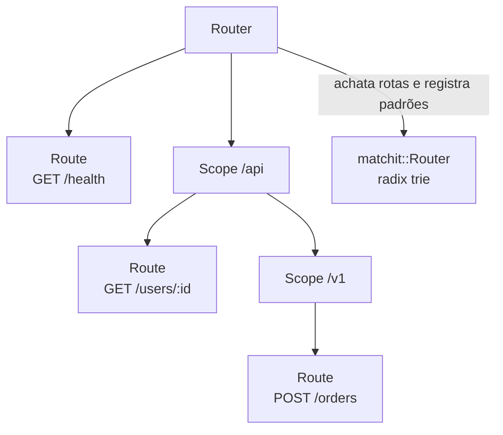
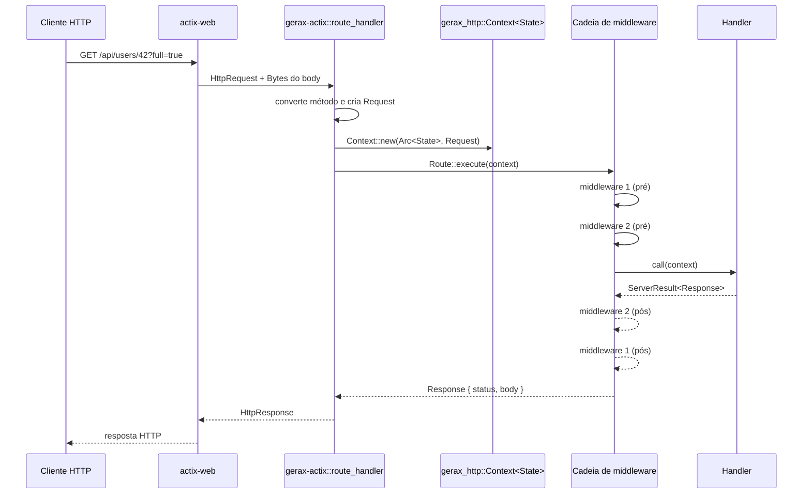
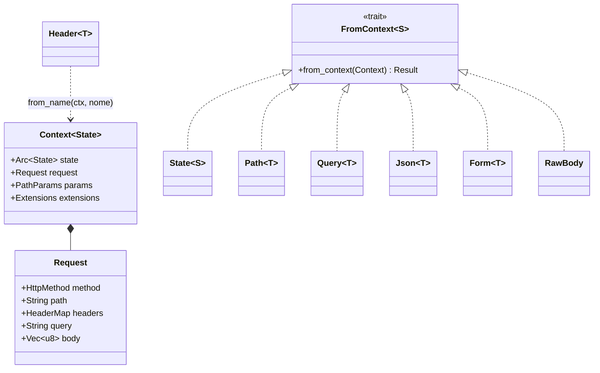

# Gerax HTTP + Actix: diagrama didático

`gerax-http` é a camada de abstração: descreve como um servidor, as rotas,
os middlewares e os handlers se comportam, sem depender de um servidor web
concreto. `gerax-actix` é um adaptador que materializa essas abstrações em
`actix-web`.

## 1. Construção do servidor



O `ActixHttpServerBuilder` implementa o trait `HttpServerBuilder<State>` de
`gerax-http`. Ao construir o servidor, o estado passa a ser compartilhado por
`Arc<State>` e o `Router<State>` também é guardado em `Arc`.

## 2. Modelo de rotas em `gerax-http`



Cada `Route` reúne método HTTP, padrão de caminho, handler e middlewares
próprios. Um `Scope` adiciona prefixo e pode acumular rotas, subescopos e
middlewares. Para o roteamento puro, o `Router` achata essa árvore e cria o
matcher `matchit`; no match, ele também preenche os parâmetros de rota no
`Context`.

## 3. Caminho de uma requisição no adaptador Actix



Para uma rota direta, os middlewares são concatenados nesta ordem:

```text
middlewares da rota -> middlewares do Router -> middlewares do servidor
```

Como `Route::execute` monta a continuação em ordem reversa, a execução de
entrada ocorre exatamente na ordem acima; o retorno percorre a ordem inversa.
Um middleware pode não chamar `next.call(ctx)` e devolver uma `Response`,
encerrando a requisição antecipadamente.

Em rotas dentro de um `Scope`, o adaptador usa esta ordem de composição:

```text
middlewares da rota -> middlewares do Scope -> middlewares do Router -> middlewares do servidor
```

## 4. Dados disponíveis ao handler



`Path`, `Query`, `Json`, `Form` e `RawBody` implementam `FromContext`.
`Header<T>` é extraído explicitamente com `Header::from_name(&ctx, "nome")`.

## Observações sobre a implementação atual

- O `Router::handle` de `gerax-http` usa a radix trie, faz o match por caminho
  e método, e coloca parâmetros como `:id` no `Context`.
- No caminho executado por `gerax-actix`, o Actix faz o match das rotas
  registradas e chama diretamente `Route::execute`; portanto, o adaptador não
  chama `Router::handle` e não transfere os headers do `HttpRequest` para o
  `gerax_http::Request`.
- `gerax-actix` registra as rotas diretas do `Router` e as rotas diretas de
  cada `Scope` de primeiro nível. Subescopos existentes no modelo puro de
  `gerax-http` não são registrados pelo adaptador atual.
- `Options` é convertido para `Method::OPTIONS`, mas o registro de handlers do
  adaptador não tem um ramo específico para ele (cai no fallback `GET`).

Esses últimos pontos descrevem o código atual e são bons candidatos a testes
de integração ou a uma evolução do adaptador.
