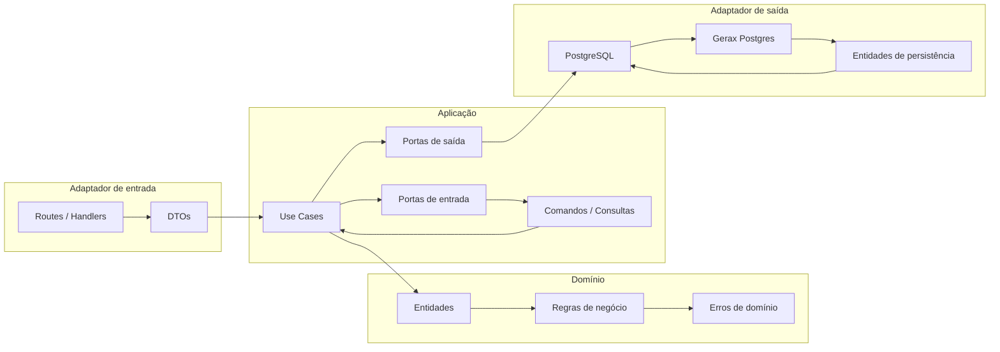

# app_students_v2

Exemplo de aplicação escolar em Rust usando Gerax com arquitetura hexagonal (portas e adaptadores). Mantém compatibilidade com a API REST da v1 em `examples/app_students` e separa domínio/aplicação de framework HTTP e PostgreSQL.

## Pré-requisitos

- Rust 1.96.1+
- PostgreSQL 14+
- `GERAX_DATABASE_URL` configurada, por exemplo: `postgresql://localhost/app_students`

## Como executar

```bash
cargo run -p app_students_v2
```

A aplicação inicia em `http://0.0.0.0:8080` com CORS habilitado para `http://localhost:5173`.

## Estrutura

```mermaid
flowchart TD
    A[main.rs] --> B[domain]
    A --> C[application]
    A --> D[adapters]
    A --> E[bootstrap]

    B --> B1[school.rs]
    C --> C1[errors.rs]
    C --> C2[ports]
    C --> C3[use_cases]

    C2 --> C2a[aluno.rs]
    C2 --> C2b[professor.rs]
    C2 --> C2c[turma.rs]
    C2 --> C2d[matricula.rs]
    C2 --> C2e[aluno_por_turma.rs]

    C3 --> C3a[alunos.rs]
    C3 --> C3b[professores.rs]
    C3 --> C3c[turmas.rs]
    C3 --> C3d[matriculas.rs]

    D --> D1[inbound]
    D --> D2[outbound]

    D1 --> D1a[http]
    D1a --> D1a1[dto.rs]
    D1a --> D1a2[handlers.rs]
    D1a --> D1a3[routes.rs]

    D2 --> D2a[postgres]
    D2a --> D2a1[mod.rs]

    E --> E1[AppState]
    E --> E2[run()]
```

## Arquitetura



## Endpoints

### Alunos
- `GET /alunos`
- `POST /alunos`
- `GET /alunos/:id`
- `PUT /alunos/:id`
- `DELETE /alunos/:id`

### Professores
- `GET /professores`
- `POST /professores`
- `GET /professores/:id`
- `PUT /professores/:id`
- `DELETE /professores/:id`

### Turmas
- `GET /turmas`
- `POST /turmas`
- `GET /turmas/:id`
- `PUT /turmas/:id`
- `DELETE /turmas/:id`
- `GET /turmas/:id/alunos`

### Matrículas
- `GET /matriculas`
- `POST /matriculas`
- `GET /matriculas/:id`
- `DELETE /matriculas/:id`

## Regras de negócio

- Campos obrigatórios validados no domínio para `nome`, `email`, `professor_id`, `aluno_id` e `turma_id`.
- Matrícula duplicada é rejeitada quando o aluno já está na turma.
- A consulta de alunos por turma é atendida por uma porta específica `AlunoPorTurmaQuery`.

## Testes

```bash
cargo test -p app_students_v2
```

Os testes usam repositórios falsos em memória e não requerem banco de dados.
